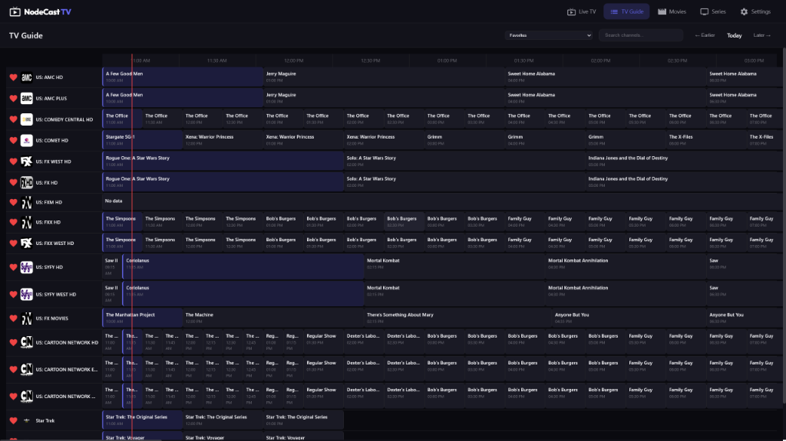
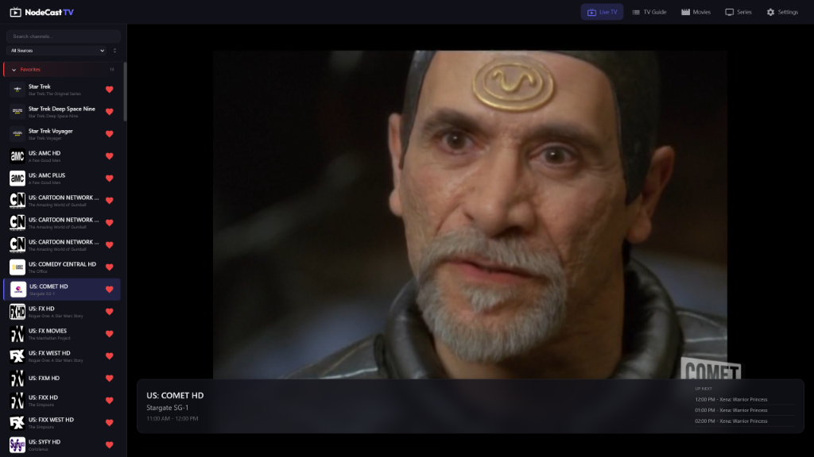
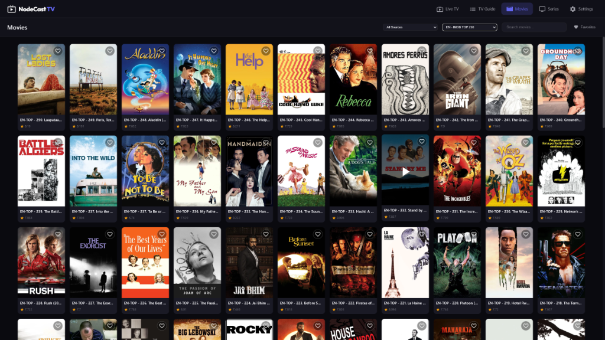
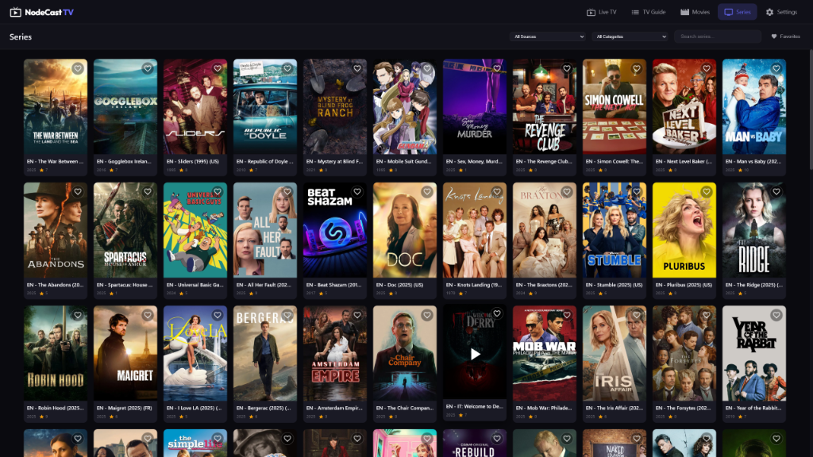

# NodeCast TV

A modern, web-based IPTV player featuring Live TV, EPG, Movies (VOD), and Series support. Built with performance and user experience in mind.

## Features

- **📺 Live TV**: Fast channel zapping, category grouping, and search.
- **📅 TV Guide (EPG)**: Interactive grid guide with 24h timeline, search, and dynamic resizing.
- **🎬 VOD Support**: Dedicated sections for Movies and TV Series with rich metadata, posters, and seasonal episode lists.
- **❤️ Favorites System**: Unified favorites for channels, movies, and series with instant synchronization.
- **⚡ High Performance**: Optimized for large playlists (7000+ channels) using virtual scrolling and batch rendering.
- **⚙️ Management**: 
  - Support for Xtream Codes and M3U playlists.
  - Manage hidden content categories.
  - Playback preferences (volume memory, auto-play).
- **🐳 Docker Ready**: Easy deployment containerization.

## Screenshots

<div align="center">
  
  
  
  
</div>

## Getting Started

### Prerequisites

- Node.js (v14 or higher)
- npm

### Installation

1.  Clone the repository:
    ```bash
    git clone https://github.com/yourusername/nodecast-tv.git
    cd nodecast-tv
    ```

2.  Install dependencies:
    ```bash
    npm install
    ```

3.  Start the development server:
    ```bash
    npm run dev
    ```

4.  Open your browser at `http://localhost:3000`.

### Docker Deployment

You can run NodeCast TV easily using Docker.

1.  Create a `docker-compose.yml` file (or copy the one from this repo):

    ```yaml
    services:
      nodecast-tv:
        build: https://github.com/technomancer702/nodecast-tv.git#main
        container_name: nodecast-tv
        ports:
          - "3000:3000" # Host:Container
        volumes:
          - ./data:/app/data
        restart: unless-stopped
        environment:
          - NODE_ENV=production
          - PORT=3000 # Optional: Internal container port
    ```

2.  Run the container:
    ```bash
    docker-compose up -d
    ```

The application will be available at `http://localhost:3000`.

## Browser Codec Support

NodeCast TV is a web-based application, which means **video decoding is handled by your browser**, not by the server. The server simply proxies the stream data - it does not transcode or re-encode video.

This means codec support depends entirely on what your browser can decode natively:

| Codec | Chrome | Firefox | Safari | Edge |
|-------|--------|---------|--------|------|
| **H.264 (AVC)** | ✅ | ✅ | ✅ | ✅ |
| **H.265 (HEVC)** | ❌¹ | ❌ | ✅ | ⚠️² |
| **VP9** | ✅ | ✅ | ⚠️³ | ✅ |
| **AV1** | ✅ | ✅ | ❌ | ✅ |
| **AAC Audio** | ✅ | ✅ | ✅ | ✅ |
| **AC3/EAC3 (Dolby)** | ❌ | ❌ | ✅ | ❌ |
| **MP3 Audio** | ✅ | ✅ | ✅ | ✅ |

**Notes:**
1. Chrome may support HEVC on macOS with hardware decoder
2. Edge requires the paid "HEVC Video Extensions" from Microsoft Store ($0.99)
3. Safari VP9 support varies by device/version

**If a stream doesn't play:**
- The stream codec may not be supported by your browser
- Try a different browser (Safari for HEVC/Dolby, Chrome/Edge for VP9/AV1)
- Check if your IPTV provider offers alternative stream formats

## Supported Stream Types

NodeCast TV is optimized for **HLS (HTTP Live Streaming)**.

-   **✅ HLS (`.m3u8`)**: Fully supported and recommended. Best for adaptive bitrate and network resilience.
-   **✅ MPEG-TS (`.ts`)**: Supported via the backend proxy. Works well for standard IPTV providers (Xtream Codes).
-   **⚠️ High Latency/P2P**: For sources like Acestream, prefer HLS output (`.m3u8`) over raw TS streams to avoid timeouts during buffering.
-   **❌ RTMP/RTSP**: Not supported natively by browsers.

### Acestream / P2P Streaming
If you are using `acestream-docker-home` or similar tools, you **MUST** use the HLS output format.

-   **Don't use**: `http://proxy:6878/ace/getstream?id=...` (This is a raw MPEG-TS stream)
-   **Do use**: `http://proxy:6878/ace/manifest.m3u8?id=...` (This wraps the stream in a browser-friendly HLS playlist)

## Technology Stack

- **Backend**: Node.js, Express
- **Frontend**: Vanilla JavaScript (ES6+), CSS3
- **Database**: JSON-based local storage (LowDB style)
- **Streaming**: HLS.js for stream playback

## Project Structure

```
nodecast-tv/
├── public/              # Frontend assets
│   ├── css/             # Stylesheets
│   ├── js/              # Client-side logic
│   │   ├── components/  # UI Components (ChannelList, EpgGuide, etc.)
│   │   ├── pages/       # Page Controllers (Movies, Series, etc.)
│   │   └── api.js       # API Client
│   └── index.html       # Main entry point
├── server/              # Backend server
│   ├── routes/          # API Endpoints
│   ├── services/        # Playlist parsers & logic
│   └── db.js            # Data persistence layer
└── data/                # Persistent storage (playlists, settings)
```

## Usage

1.  Go to **Settings** -> **Content Sources**.
2.  Add your IPTV provider details (Xtream Codes or M3U URL).
3.  Click "Refresh Sources".
4.  Navigate to **Live TV**, **Movies**, or **Series** to browse your content.

## License

This project is licensed under the **GNU General Public License v3.0 (GPL-3.0)**.

You are free to:
-   **Run** the program for any purpose
-   **Study** how the program works and change it
-   **Redistribute** copies
-   **Distribute** copies of your modified versions

Under the condition that:
-   You typically must distinguish your modifications from the original work
-   You provide the source code to recipients
-   You license any derivative works under the same GPL-3.0 license

See the [LICENSE](LICENSE) file for details.
